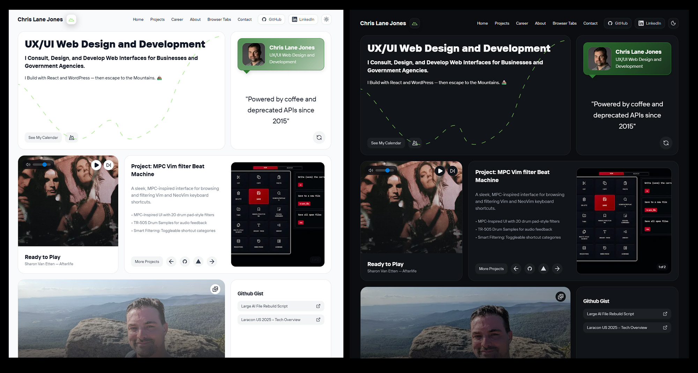

# Chris Lane Jones Portfolio

Modern portfolio website built with Next.js 14, React, TypeScript, and Tailwind CSS. Features a bento grid layout, dark mode, Framer Motion animations, and an admin dashboard for content management.



## 🚀 Tech Stack

- **Framework:** [Next.js](https://nextjs.org/) 14 (App Router)
- **Language:** [TypeScript](https://www.typescriptlang.org/)
- **Styling:** [Tailwind CSS](https://tailwindcss.com/)
- **Animations:** [Framer Motion](https://www.framer.com/motion/)
- **Database:** [Convex](https://www.convex.dev/) (real-time backend)
- **File Uploads:** [UploadThing](https://uploadthing.com/) (CDN-hosted media)
- **Authentication:** [Clerk](https://clerk.com/)
- **Analytics:** [PostHog](https://posthog.com/) (product analytics & session recording)
- **UI Components:** [Radix UI](https://www.radix-ui.com/), [shadcn/ui](https://ui.shadcn.com/)
- **Drag & Drop:** [@dnd-kit](https://dndkit.com/)
- **Icons:** [Lucide React](https://lucide.dev/guide/packages/lucide-react), [React Icons](https://react-icons.github.io/react-icons/), [Simple Icons](https://simpleicons.org/)
- **Package Manager:** [Bun](https://bun.sh/)

## ✨ Features

### 🎨 Frontend
- Modern bento grid homepage layout
- Dark mode with system preference detection
- Smooth animations with Framer Motion
- Fully responsive design
- Interactive music player
- Photo gallery with Polaroid-style drawer
- Project showcase with carousel
- Blog post pages with rich content

### 🔐 Admin Dashboard
- Clerk authentication
- **Media Manager** - Drag-and-drop image assignment to pages and blog posts
- **Blog Post Manager** - Create and edit blog posts with UploadThing media uploads
- **Career Timeline Manager** - Manage work history and experiences
- **Links Manager** - Curate and organize browser tabs/resource links
- **Settings Manager** - Update site metadata and SEO
- Real-time updates with Convex

### 📊 Analytics & Monitoring
- PostHog analytics with session recording
- User behavior tracking
- Performance monitoring

## 🚦 Getting Started

### Prerequisites

- [Node.js](https://nodejs.org/en/) 18+ or [Bun](https://bun.sh/)
- [Clerk](https://clerk.com/) account
- [Convex](https://www.convex.dev/) account
- [UploadThing](https://uploadthing.com/) account
- [PostHog](https://posthog.com/) account (for analytics)

### Installation

1. Clone the repository:

```bash
git clone https://github.com/chrislanejones/future-chrislanejones.git
cd future-chrislanejones
```

2. Install dependencies:

```bash
bun install
# or
npm install
```

3. Set up environment variables:

Create a `.env.local` file in the root directory:

```bash
# Convex
NEXT_PUBLIC_CONVEX_URL=your_convex_url

# Clerk
NEXT_PUBLIC_CLERK_PUBLISHABLE_KEY=your_clerk_publishable_key
CLERK_SECRET_KEY=your_clerk_secret_key

# UploadThing
UPLOADTHING_API_KEY=your_uploadthing_api_key

# PostHog Analytics
NEXT_PUBLIC_POSTHOG_KEY=your_posthog_project_api_key
NEXT_PUBLIC_POSTHOG_HOST=https://app.posthog.com
```

4. Initialize Convex:

```bash
npx convex dev
```

5. Seed the database (optional):

```bash
# Seed SEO settings
npx convex run settings:seed

# Seed blog posts
npx convex run blogPosts:seedBlogPosts

# Seed browser links
npx convex run browserLinks:seedBrowserLinks
```

6. Run the development server:

```bash
bun dev
# or
npm run dev
```

Open [http://localhost:3000](http://localhost:3000) to view the site.

## 📦 Key Dependencies

```json
{
  "next": "14.1.4",
  "react": "^18",
  "typescript": "^5",
  "tailwindcss": "^3.4.17",
  "framer-motion": "^10.16.16",
  "convex": "^1.27.5",
  "@clerk/nextjs": "5.7.4",
  "uploadthing": "^7.7.4",
  "@uploadthing/react": "^7.7.4",
  "@dnd-kit/core": "^6.3.1",
  "@dnd-kit/sortable": "^9.0.0",
  "@radix-ui/react-*": "latest",
  "lucide-react": "^0.552.0",
  "posthog-js": "^1.275.1"
}
```

## 🎯 Admin Dashboard

Access the admin dashboard at `/admin` (requires authentication via Clerk):

### Media Manager
- Upload images to UploadThing CDN
- Organize media by pages and blog posts
- Drag-and-drop to assign images to content
- Search and filter capabilities
- Real-time preview

### Content Management
- **Blog Posts**: Create, edit, and publish blog posts with rich content
- **Career Timeline**: Manage work experience and career milestones
- **Browser Links**: Curate resource collections and bookmarks
- **Settings**: Update site metadata, SEO, and configuration

All changes are saved in real-time to Convex and immediately reflected on the live site.

## 📄 License

This project is open source and available under the [MIT License](LICENSE).

## 👤 Author

**Chris Lane Jones**

- Website: [chrislanejones.com](https://chrislanejones.com)
- GitHub: [@chrislanejones](https://github.com/chrislanejones)
- LinkedIn: [/in/chrislanejones](https://linkedin.com/in/chrislanejones)
- Twitter: [@cljwebdev](https://twitter.com/cljwebdev)