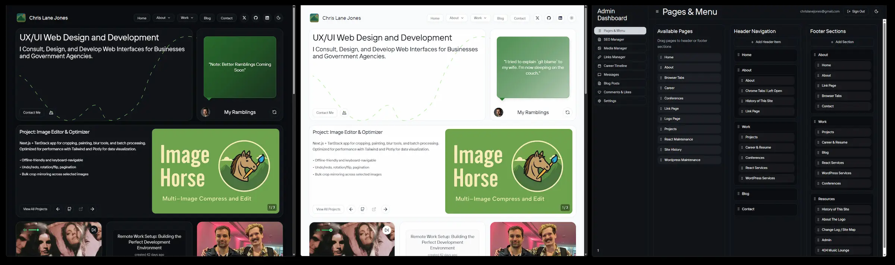

# Chris Lane Jones Portfolio

Modern portfolio website built with Next.js 16, React 19, TypeScript, Effect, and Tailwind CSS v4. Features a bento grid layout, dark mode, Framer Motion animations, and an admin dashboard with Convex database for content management.

[Vercel Live Link - https://future-chrislanejones.vercel.app/](https://future-chrislanejones.vercel.app/)



## 🚀 Tech Stack

- **Framework:** [Next.js](https://nextjs.org/) 14 (App Router)
- **Language:** [TypeScript](https://www.typescriptlang.org/)
- **Styling:** [Tailwind CSS](https://tailwindcss.com/)
- **Animations:** [Framer Motion](https://www.framer.com/motion/)
- **Database:** [Convex](https://www.convex.dev/) (real-time backend)
- **File Uploads:** [UploadThing](https://uploadthing.com/) (CDN-hosted media)
- **Authentication:** [Clerk](https://clerk.com/)
- **Error Handling:** [Effect.ts](https://effect.website/) (typed errors & functional pipelines)
- **Analytics:** [PostHog](https://posthog.com/) (product analytics & session recording)
- **UI Components:** [Radix UI](https://www.radix-ui.com/), [shadcn/ui](https://ui.shadcn.com/)
- **Drag & Drop:** [@dnd-kit](https://dndkit.com/)
- **Icons:** [Lucide React](https://lucide.dev/guide/packages/lucide-react), [React Icons](https://react-icons.github.io/react-icons/), [Simple Icons](https://simpleicons.org/)
- **Package Manager:** [pnpm](https://pnpm.io/)
- **Analytics:** [Google Analytics 4](https://analytics.google.com/) (gtag)
- **Error Monitoring:** [Sentry](https://sentry.io/)

## ✨ Features

### 🎨 Frontend

- Modern bento grid homepage layout
- Dark mode with system preference detection
- Smooth animations with Framer Motion
- Fully responsive design
- Interactive music player
- Photo gallery with Polaroid-style drawer
- Project showcase with carousel
- Blog post pages with rich content
- Conference archive with year/talk pages
- Career timeline with downloadable resume (PDF & DOCX)
- Site history timeline
- React & WordPress maintenance services pages
- Auto-generated `/sitemap.xml` (static + Convex-sourced blog slugs, 1h revalidation)
- Centralized animation system (`src/lib/animations.ts`) — shared spring variants used across all pages

### 🔐 Admin Dashboard

- Clerk authentication
- **Media Manager** - Drag-and-drop image assignment to pages and blog posts
- **Blog Post Manager** - Create and edit blog posts with UploadThing media uploads
- **Career Timeline Manager** - Manage work history and experiences
- **Projects Manager** - Add and manage featured projects with GitHub/live links
- **Links Manager** - Curate and organize browser tabs/resource links
- **Settings Manager** - Update site metadata and SEO
- **SEO Manager** - Per-page SEO metadata served via Convex HTTP (`/seo?path=`)
- Real-time updates with Convex

### 🛡️ Error Handling & Data Flow

- Effect.ts for type-safe error handling
- Functional pipelines for data transformations
- Composable effects for async operations
- Explicit error types for better debugging

### 📊 Analytics & Monitoring

- PostHog analytics with session recording
- User behavior tracking
- Performance monitoring

## 🚦 Getting Started

### Prerequisites

- [Node.js](https://nodejs.org/en/) 18+ and [pnpm](https://pnpm.io/)
- [Clerk](https://clerk.com/) account
- [Convex](https://www.convex.dev/) account
- [UploadThing](https://uploadthing.com/) account
- [PostHog](https://posthog.com/) account (for analytics)
- [Google Analytics](https://analytics.google.com/) property (for gtag)

### Installation

1. Clone the repository:

```bash
git clone https://github.com/chrislanejones/future-chrislanejones.git
cd future-chrislanejones
```

2. Install dependencies:

```bash
pnpm install
```

3. Set up environment variables:

Create a `.env.local` file in the root directory:

```bash
# Convex
NEXT_PUBLIC_CONVEX_URL=your_convex_deployment_url
NEXT_PUBLIC_CONVEX_SITE_URL=your_convex_site_url   # used for sitemap & SEO HTTP endpoints
CONVEX_DEPLOYMENT=dev:your-deployment-name

# Clerk
NEXT_PUBLIC_CLERK_PUBLISHABLE_KEY=your_clerk_publishable_key
CLERK_SECRET_KEY=your_clerk_secret_key

# UploadThing
UPLOADTHING_API_KEY=your_uploadthing_api_key

# PostHog Analytics — must be a project key starting with phc_, NOT a personal phx_ key
NEXT_PUBLIC_POSTHOG_KEY=phc_your_posthog_project_key
NEXT_PUBLIC_POSTHOG_HOST=https://us.i.posthog.com

# Google Analytics
NEXT_PUBLIC_GA_ID=G-XXXXXXXXXX
```

4. Initialize Convex:

```bash
npx convex dev
```

5. Seed the database (optional):

```bash
# Seed SEO settings
npx convex run settings:seed

# Seed blog posts
npx convex run blogPosts:seedBlogPosts

# Seed browser links
npx convex run browserLinks:seedBrowserLinks
```

6. Run the development server:

```bash
pnpm dev
```

> **Note:** Run `npx convex dev` in a separate terminal alongside `pnpm dev` to keep the Convex backend in sync during development.

Open [https://www.chrislanejones.com](https://www.chrislanejones.com) to view the site.

## 📦 Key Dependencies

```json
{
  "next": "16.2.3",
  "react": "^19.2.5",
  "typescript": "^6.0.2",
  "tailwindcss": "^4.2.2",
  "framer-motion": "^12.38.0",
  "convex": "^1.34.1",
  "@clerk/nextjs": "7.0.12",
  "effect": "^3.21.0",
  "uploadthing": "^7.7.4",
  "@uploadthing/react": "^7.3.3",
  "@dnd-kit/core": "^6.3.1",
  "@dnd-kit/sortable": "^10.0.0",
  "@radix-ui/react-*": "latest",
  "lucide-react": "^1.7.0",
  "posthog-js": "^1.365.4"
}
```

## 🎯 Admin Dashboard

Access the admin dashboard at `/admin` (requires authentication via Clerk):

### Media Manager

- Upload images to UploadThing CDN
- Organize media by pages and blog posts
- Drag-and-drop to assign images to content
- Search and filter capabilities
- Real-time preview

### Content Management

- **Blog Posts**: Create, edit, and publish blog posts with rich content
- **Career Timeline**: Manage work experience and career milestones
- **Browser Links**: Curate resource collections and bookmarks
- **Settings**: Update site metadata, SEO, and configuration

All changes are saved in real-time to Convex and immediately reflected on the live site.

## 📄 License

This project is open source and available under the [MIT License](LICENSE).

## 👤 Author

**Chris Lane Jones**

- Website: [chrislanejones.com](https://chrislanejones.com)
- GitHub: [@chrislanejones](https://github.com/chrislanejones)
- LinkedIn: [/in/chrislanejones](https://linkedin.com/in/chrislanejones)
- Twitter: [@cljwebdev](https://twitter.com/cljwebdev)
